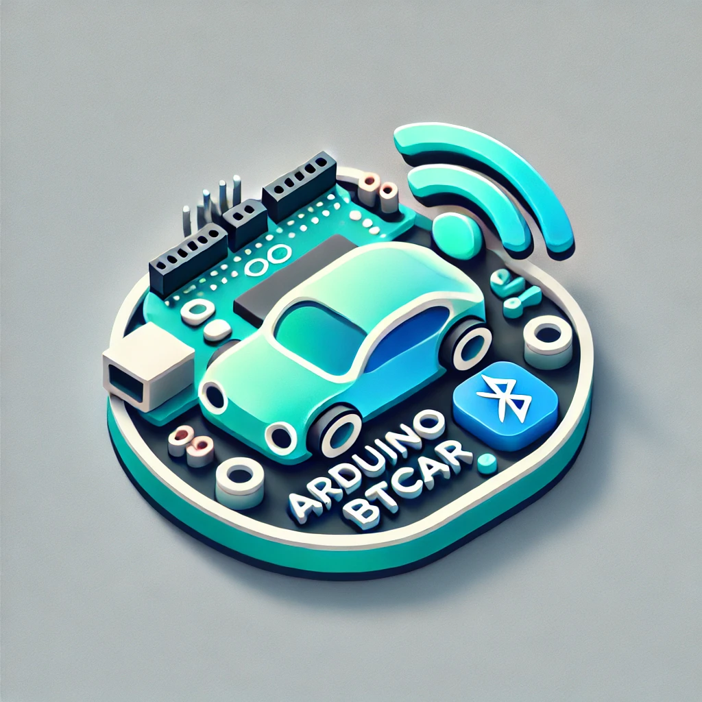
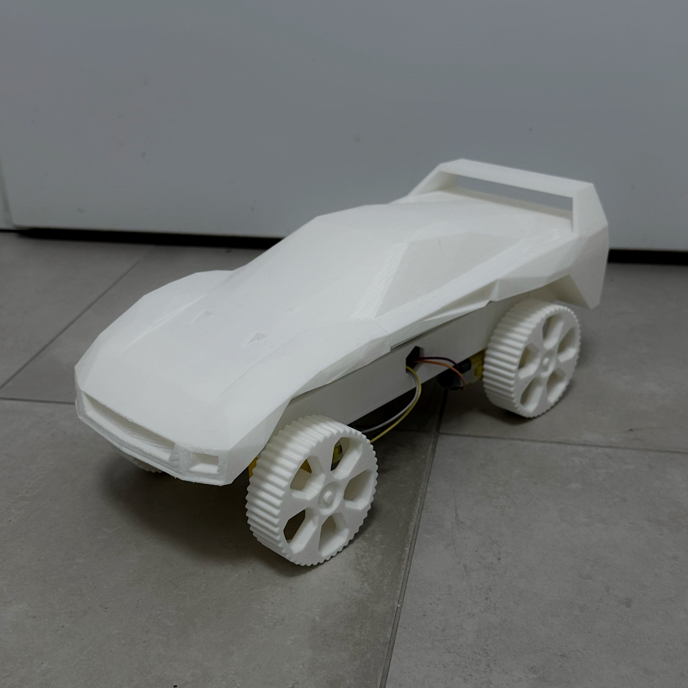
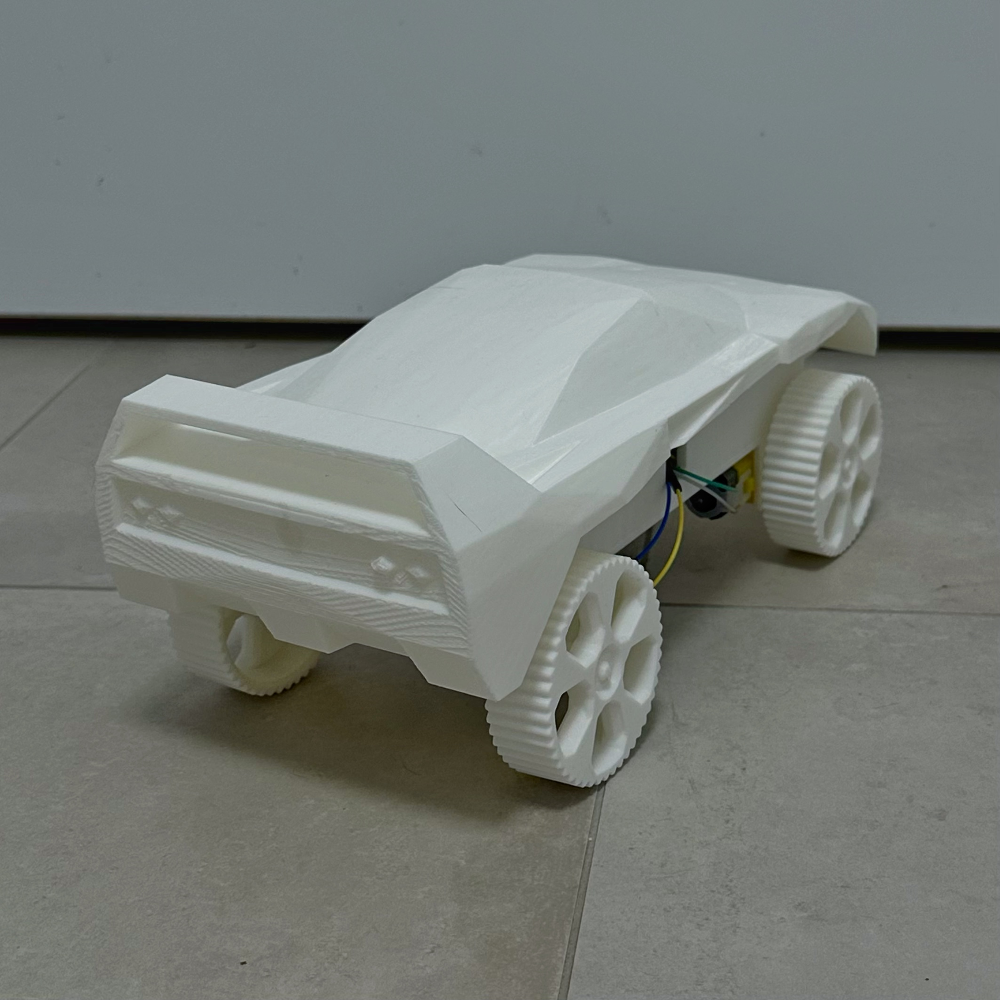
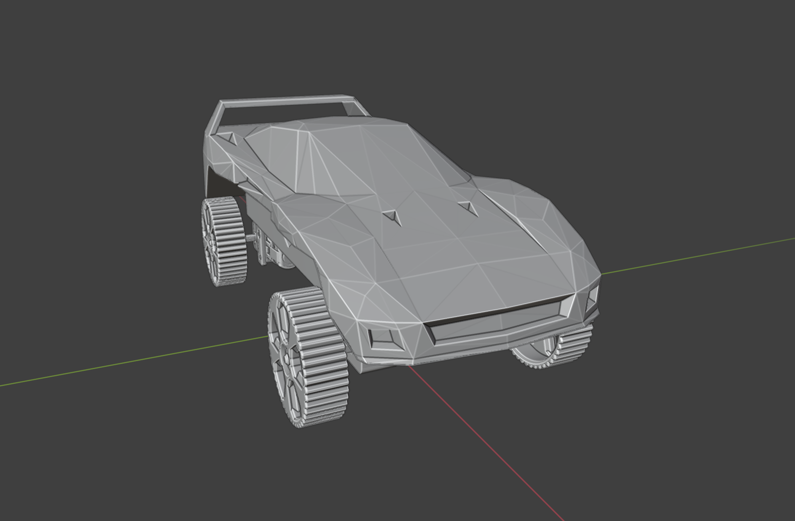
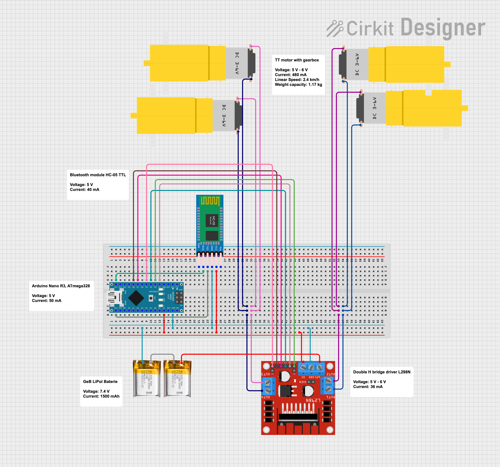

<div align="center">
  
</div>

<br>

<div align="center">

  [](https://github.com/marsdevx/arduino-BTcar/commits/main "Last Commit")
  [](https://docs.arduino.cc/language-reference "Languages")
  <br>
  [](https://github.com/marsdevx/arduino-BTcar/blob/main/controller.apk "Supported Platforms")
  [](https://www.blender.org "Modeling Software")
  [](https://docs.arduino.cc/hardware/nano "Board")
  [](https://github.com/marsdevx/arduino-BTcar "Includes")
  [](https://github.com/marsdevx/arduino-BTcar/blob/main/LICENSE "License")

</div>

---

# 🚗 Arduino Bluetooth Car

**Arduino Bluetooth Car** is an **open-source** project that guides you through building a **Bluetooth-controlled car** using **Arduino**. It includes everything from **3D-printable** **STL files** and **wiring diagrams** to **Arduino code** and a **mobile app**, making it a comprehensive solution for electronics and embedded systems development.

* Includes **STL** files for **3D-printing** the **car** components.
* Fully functional **Arduino** **code** to **control motors** and **Bluetooth** communication.
* Detailed **circuit** **diagrams** for easy and accurate assembly.
* Custom **Android** **app** for real-time car **control via Bluetooth**.
* Ideal for students, makers, and **robotics** enthusiasts.

Gain practical experience with a fully functional prototype!

---

## 🖼️ Preview

<div align="center">
  
  
</div>

---

## 🛠️ Assembly Guide

> Follow these steps to build your Car from scratch

1. **Gather the Components**
  - Arduino Nano
  - Bluetooth module HC-05 TTL
  - Double H bridge driver L298N
  - 4x TT motors with gearbox
  - 2x GeB LiPol Baterie 3.7V
  - Breadboard 830 points
  - Dupont Wires (M-M, F-F, M-F)

<br>

2. **Print and Assemble the Car Body**

  <div align="left">
    
  </div>

  - All `.stl` files are ready for printing and are located in the [`3d-models/`](3d-models/) folder.
  - You will need to print [`nail.stl`](3d-models/nail.stl) **8 times** and [`wheel.stl`](3d-models/wheel.stl) **4 times**.
  - To help visualize the complete car, refer to the included Blender file: [`arduino-BTcar.blend`](3d-models/arduino-BTcar.blend).
  - Open this `.blend` file in [Blender](https://www.blender.org) to view the correct orientation and placement of all printed components.

<br>

3. **Assemble the Electronics**

  <div align="left">
    
  </div>

  - Refer to the wiring diagram [`circuit.png`](circuit/circuit.png) for a clear view of the complete setup.
  - Ensure all **power supply** connections are secure and correct to avoid hardware damage.
  - You can also explore the circuit in an editable format by opening the [`circuit.ckt`](circuit/circuit.ckt) file.
  - Open this `.ckt` file in [Cirkit Designer IDE](https://app.cirkitdesigner.com/project) or any compatible circuit design software.

<br>

4. **Upload the Code**
  - Connect the **Arduino Nano** to your computer using a **Mini-B USB** cable.
  - Open [`code.ino`](code.ino) in the [Arduino IDE](https://www.arduino.cc/en/software)
  - Select **Arduino Nano** and correct **COM port**
  - Click **Upload**

<br>

5. **Install the App**
  - Download the `controller.apk` from the repo root or click [here](controller.apk).
  - Install it on your Android device (you may need to allow unknown sources).
  - Enable Bluetooth and connect to **HC-05**. The default pairing password is `1234`.
  - Open the app, tap **Connect**, and choose **HC-05**. Wait until the **Connect** button becomes dark — this indicates a successful connection.

---

## 📋 License

All the code contained in this repo is licensed under the [MIT License](LICENSE)

```
MIT License

Copyright (c) 2025 marsdevx

Permission is hereby granted, free of charge, to any person obtaining a copy
of this software and associated documentation files (the "Software"), to deal
in the Software without restriction, including without limitation the rights
to use, copy, modify, merge, publish, distribute, sublicense, and/or sell
copies of the Software, and to permit persons to whom the Software is
furnished to do so, subject to the following conditions:

The above copyright notice and this permission notice shall be included in all
copies or substantial portions of the Software.

THE SOFTWARE IS PROVIDED "AS IS", WITHOUT WARRANTY OF ANY KIND, EXPRESS OR
IMPLIED, INCLUDING BUT NOT LIMITED TO THE WARRANTIES OF MERCHANTABILITY,
FITNESS FOR A PARTICULAR PURPOSE AND NONINFRINGEMENT. IN NO EVENT SHALL THE
AUTHORS OR COPYRIGHT HOLDERS BE LIABLE FOR ANY CLAIM, DAMAGES OR OTHER
LIABILITY, WHETHER IN AN ACTION OF CONTRACT, TORT OR OTHERWISE, ARISING FROM,
OUT OF OR IN CONNECTION WITH THE SOFTWARE OR THE USE OR OTHER DEALINGS IN THE
SOFTWARE.
```
---

## ⭐ Support

If you like this project, don’t forget to ⭐ **star** it and **follow** me!  
Your **support** helps me create more projects. 🚀  

🔗 **Explore more of my work on [GitHub](https://github.com/marsdevx?tab=repositories) and discover other exciting projects!**